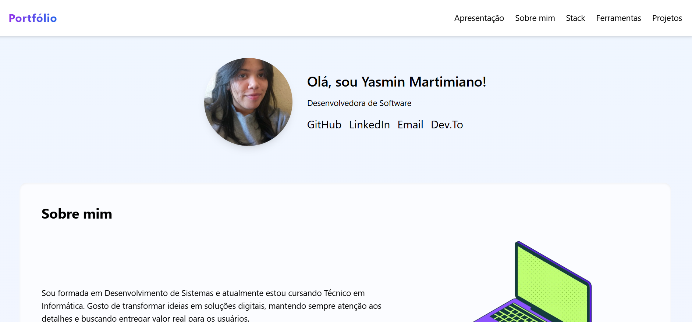

<h1 align="center"> Portfólio - Yasmin Martimiano 💻</h1

<h4 align="center"><a href="https://portifolio-git-main-yasmartimianos-projects.vercel.app" target="_blank"> Acesse o projeto aqui</a></h4>

---

  

---

## 🌐 Sobre o projeto

Este portfólio foi desenvolvido com o objetivo de apresentar quem eu sou como **Desenvolvedora de Software**, mostrando minhas **habilidades, ferramentas, tecnologias e projetos**.  

O layout é **totalmente responsivo**, com um visual limpo, moderno e inspirado em tons suaves de roxo e azul.  

Este projeto está **em constante desenvolvimento**, pois estou sempre aprimorando minhas habilidades e adicionando novas seções e melhorias visuais.

---

##  Estrutura do site

O site é dividido em seções simples e intuitivas:

- **Apresentação:** Minha introdução, foto e links para GitHub, LinkedIn, e-mail e Dev.to;  
- **Sobre mim:** Um breve resumo da minha formação e o que me motiva na área de tecnologia;  
- **Stack:** Tecnologias que mais utilizo no desenvolvimento;  
- **Ferramentas:** Ambientes e softwares do meu dia a dia;  
- **Projetos:** Exposição de projetos desenvolvidos, com descrição, tecnologias e link para o repositório no GitHub.

---

## 🛠️ Tecnologias utilizadas

  
  
  

---

## 📚 Conceitos aplicados

Durante o desenvolvimento deste portfólio, foram trabalhados conceitos como:

+ Estruturação **semântica** em HTML;  
+ Uso do **Tailwind CSS** para estilização moderna e responsiva; 
+ Implementação de **layout mobile-first**.

---

## 🏆 Licença

Este projeto está sob a licença **MIT** — sinta-se à vontade para se inspirar e aprender com ele!
